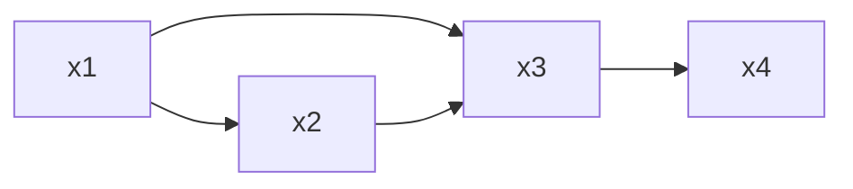

# Probabilistic Graphical Models

- Representing complex models in a compact, intuitive, and interpretable way
- By exploiting conditional independence, we can achieve efficient inference

## Joint Probability Distribution
- The Joint Probability Distribution (JPD) is a way to represent the probability of all possible combinations of a set of random variables
- For n variables, each with d possible values, the JPD has dn rows
- The JPD is a complete representation of the model
- It’s a powerful tool, but it has limitations

Example: Exam result
- Let’s say we have two random variables: Exam result and Studying
- The JPD for these two (binary) variables has 4 rows
- If we add a third binary variable, e.g., Sleep, the JPD has 8 rows
- For 10 variables, the JPD has 210 = 1024 rows
- For 100 variables, the JPD has 2100 ≈ 1.27 × 1030 rows
- The JPD grows exponentially with the number of variables
- It becomes infeasible to compute and store the JPD for a large number of variables
- We need to find ways to simplify the model and represent it in a more compact way

## Simplification Strategies

- The model can be simplified by making assumptions about the variables and/or relationships between them, based on domain knowledge and the problem we are trying to solve

>Three assumptions can be made (even if they may not be entirely true)
	▶ Not all variables are relevant
	▶ Independence between variables
	▶ Conditional independence between variables

- Any simplification we make will introduce some level of noise in the model

## Not all variables are relevant

- Not all variables are relevant to the problem we are trying to solve, e.g.:
	The color of the shirt you are wearing might not be relevant to your exam result
- Some variables might have a negligible effect on the outcome, e.g.:
	The number of hours of sun in the last days might not affect the probability of your exam result
- It might be too “expensive” to include a certain variable in the model, e.g.:
	The quantity of ATP in your cells might be relevant to your exam result, but it’s too expensive to measure
- Depending on what we are trying to model, we might choose to ignore these variables

## Assumption of independence

- Two variables are independent if the occurrence of one does not affect the occurrence of the other
- If A and B are independent (i.e., A ⊥ B), then:
	$$P(A,B) = P(A) * P(B)$$which tells us we can build the joint probability distribution by multiplying the simpler marginal probabilities
- Independence is a strong assumption and might not always hold in real-world scenarios (it’s more common to have $P(A,B)=P(A\mid B)*P(B)$ )

### Example 2: Independence Assumption 
Which of the following random variables seem to be independent?
▶ Clouds
▶ Exam result
▶ Wet streets
▶ Studying
From these assumptions of (in)dependence, the JPD is simplified to:
$$P(C,E,W,S)= P(C,W)*P(E,S)$$
- However:
	$$P(C,W) \not= P(C)*P(W), and\ P(E,S)\not=P(E)*P(S)$$
### Independence is useful
- The assumption of independence is useful because it simplifies the model
- Instead of a JPD with dn rows, we can have n marginal probabilities with d rows each
- What is the gain of being able to represent a JPD with 20 variables, with 2 independent distributions of 10 variables each?
Drawbacks:
▶ It’s a strong assumption that might not hold in real-world scenarios
▶ Adds noise to the model when the assumption isn’t true

**The goal is to find the right balance between simplicity and accuracy**

### Conditional Independence 
- It’s rare that two variables are completely independent, however, . . .
- A and B could be independent given knowledge on another variable C if:
$$P(A,B \mid C) = P(A|C)*P(B|C)$$
- i.e., knowing the value of C makes A and B independent

- Another angle: If A and B are conditionally independent given C, then: $P(A \mid B,C)=P(A\mid C)$
- i.e., knowing the value of B doesn’t add any information about A if we already know C
- Notation for conditional independence: A ⊥⊥ B | C

#### Example
- Let’s say we have three random variables: Clouds, WetStreets, and Rain
- If we say that Clouds and WetStreets are conditionally independent given Rain, then:
$$P(C, W | R) = P(C | R) · P(W | R)$$
- Or, another way to put it:
$$P(W | R, C) = P(W | R)$$
- i.e., knowing it is raining, the fact that it’s cloudy doesn’t affect the probability of the streets being wet
- Although Clouds and WetStreets might be dependent in reality, assuming conditional independence simplifies the model

- Assuming conditional independence between WetStreets and Clouds, given Rain
$$W ⊥⊥ C | R$$
- we can say
$$P(W\mid C,R)=P(W\mid R)$$
- and
$$P(C\mid W,R)= P(C\mid R)$$
Moreover, the JPD P(W, C, R) can be simplified to:
$$P(W, C, R) = P(W | R) · P(C | R) · P(R)$$
#### Overview
$$A ⊥⊥ B | C$$
- By definition:
$$P(A, B | C) = P(A | C) · P(B | C)$$
- if and only if:
$$∀, b, c : P(A = , B = b | C = c) = P(A =  | C = c) · P(B = b | C = c)$$
- Or, equivalently:
$$P(A | B, C) = P(A | C)$$
- if and only if:
$$∀, b, c : P(A = alpha; | B = b, C = c) = P(A = alpha | C = c)$$

## Breaking the chain
- The chain rule of probability states that:
$$P(X1, X2, . . . , Xn) = P(X1) · P(X2 | X1) · . . . · P(Xn | X1, X2, . . . , Xn−1)$$
- In theory, we can decompose the JPD into simpler terms, however, the last terms tend to the size of the JPD itself
- For example, for: IceCream, Sun, Toothache
	▶ The model we have is:
$$P(I, S, T) = P(I) · P(S | I) · P(T | I, S)$$
	▶ Assume S ⊥⊥ T | , what simplification can we make to the model above?

- The complexity of a model will be determined by the Conditional Independence assumptions we make

#### Treasure hunt
- T – Treasure location; ωT = {, r}
- Dl – Detector left cell; ωDl = {−, +}
- Dr – Detector right cell; ωDr = {−, +}
- Without any further information:
$$P(T = l) = 0.5$$
0.5 0.5
- Noisy detectors:
$$
\begin{align*}
P(Dl = + | T = l) = 0.8 \cr
P(Dl = + | T = r) = 0.3 \cr
P(Dr = + | T = l) = 0.3\cr
P(Dr = + | T = r) = 0.8
\end{align*}
$$
Example: What is the probability P(T = l | Dl = −, Dr = +)?

- By the chain rule : 
$$P(T,Dl,Dr)= P(T)*P(Dl|T)*P(Dr|T,Dl)$$
- What if we assume Dl ⊥⊥ Dr | T? Is it a reasonable assumption?
$P(T, Dl, Dr) = P(T) · P(Dl | T) · P(Dr | T)$

P(l, +,+) = 0,5 * 0,8 * 0,3 = 0,12
P(l,+,-) = 0,5 * 0,8 * 0,7 = 0,28
P(l,-,+) = 0,5 * 0,2 * 0,3 = 0,03
P(l,-,-) = 0,07
P(r,+,+) = 0,12
P(r,+,-) = 0,03
P(r,-,+) = 0,28
P(r,-,-) = 0,07

P(Dl=-) = P(Dl = - |T) = 0,03+0,07+0,28+0,07 = 0,45
P(Dr=+) = P

$$P(T=l \mid Dl= -, Dr= + )$$
## Probabilistic Graphical Models

- Probabilistic Graphical Models (PGMs) are a general framework to efficiently represent probabilistic models with very large numbers of variables, taking advantage of the conditional independence assumptions
- They combine probability theory and graphs to represent the structure of a probabilistic model (e.g., how variables interact with each other)
- Common PGMs include:
	▶ Bayesian Networks
	▶ Markov Networks
	▶ Hidden Markov Models
- Instead of a dn table for a joint probability distribution, we can use a graph with n nodes containing smaller conditional probability tables

### Bayesian Network
- Type of PGM that uses Bayesian inference for probability computations, without computing the full joint probability distribution
- Bayesian Networks are also called belief networks
- It’s a directed acyclic graph (DAG) whose nodes represent random variables (RVs) and, the arcs, direct dependencies between the RVs
- Each node is associated with a conditional probability distribution that quantifies the relationship between the node and its parents
- In simple terms, a BN is a way to represent knowledge so that a computer can reason with it

### Directed Acyclic Graphs
- Directed graph with no cycles
- Composed of nodes and directed edges (i.e., arcs)
- Nodes represent random variables
- Edges represent direct dependencies between the RVs
- Each node is associated with a Probability Distribution (PD)
- The PD of a node is conditioned on the parents

Note: Although not exactly the same, it’s useful to think about edges as arrows pointing from cause to effect

### How to create a probabilistic model
- Choose the random variables that you want to model
- Determine the independencies (and conditional independencies) between the variables
- Define the conditional probability distributions for each node

### When building a Bayesian Network

- It’s very unlikely that we can model every possible variable
- There are variables that, in reality, could affect our model, however, in order to simplify, we choose to ignore them
- There are interactions (i.e., dependencies) that we might choose not to consider (too small, too expensive, etc.)
- Depending on the variables and dependencies we choose, we can come up with different models
- The model is as good as the assumptions we make

