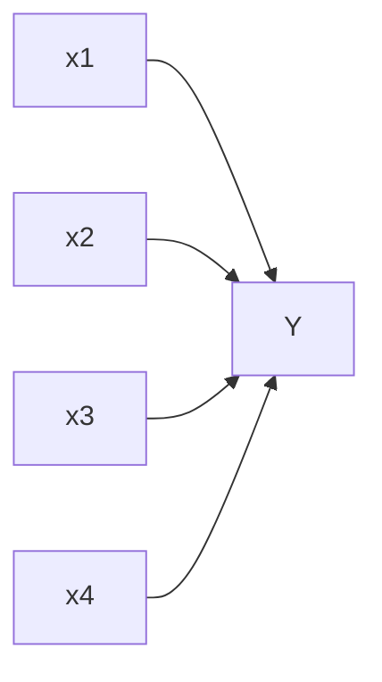
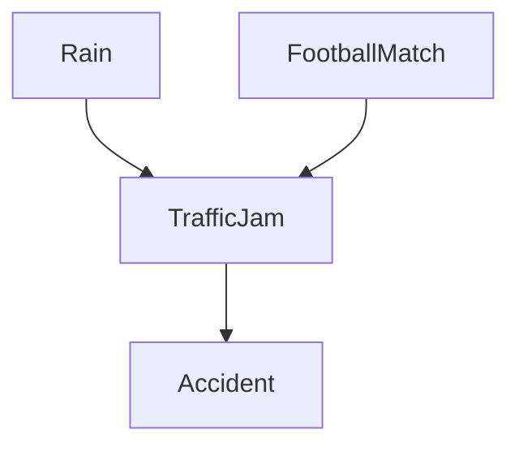
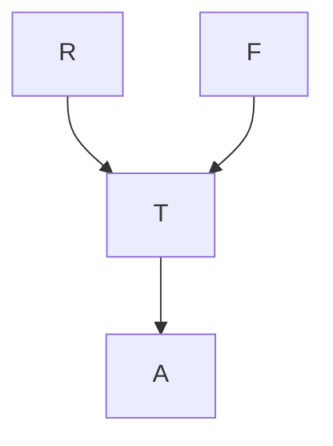
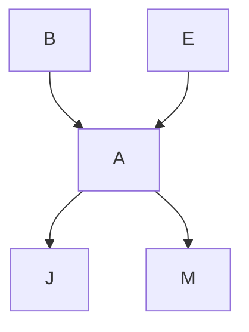
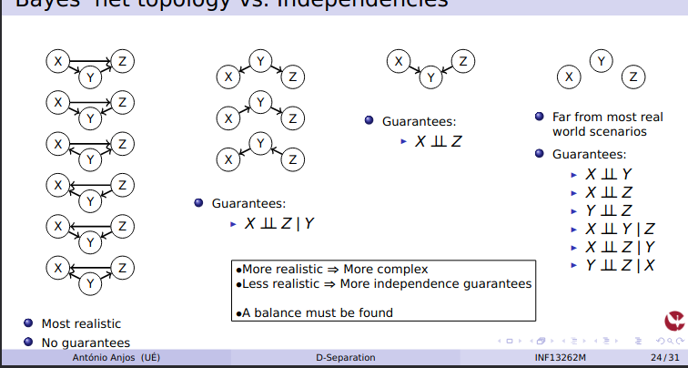

# Directional Separation

### Motivation
- Identify the conditional independence assumptions encoded in the structure of a Bayes’ net
- Model simplification, improve inference, and inference efficiency
- Better understand of causal relationships

## Bayes’ Net: Recap

- It’s Probabilistic Graphical Model (PGM)
- It’s a Directed Acyclic Graph (DAG)
- Nodes represent random variables
- Edges encode dependencies
- Each node has a Conditional Probability Distribution (CPD)

## Conditioning: Chain Rule vs. Bayes’ Nets

- Chain rule: $P(X1, . . . , Xn) = P(Xn|Xn−1, . . . , X1)P(Xn−1|Xn−2, . . . , X1) . . . P(X2|X1)P(X1) = nY X1=  P(Xi|Xi−1, . . . , X1)$
requires conditioning on all previous variables, i.e., P(Xi|X1, X2, . . . , Xi−1)

- Bayes’ nets:
$P(X1, X2, . . . , Xn) = nY i=1 P(Xi|Pa(Xi))$ requires conditioning only on the parents of each variable, i.e., P(Xi|Pa(Xi))

- Therefore, Bayes’ nets assumes:
$P(Xi|X1, X2, . . . , Xi−1) = P(Xi|Pa(Xi))$

### Mind the number of parents

- A node in a Bayes’ net can have multiple parents
- The dimension of the CPD grows exponentially with the number of parents
- Takeaway: avoid having too many parents

### Conditional Independence
- $P(Xi | X1, X2, . . . , Xi−1) = P(Xi | Pa(Xi))$ means that, given the parents of a node, the node is conditionally independent of all other nodes in the graph
- Therefore, the structure of the Bayes’ net encodes conditional independence assumptions
- Remember that 2 random variables X and Y are conditionally independent given a set of random variables Z if:
$$X ⊥⊥ Y | Z ⇒ P(X | Y, Z) = P(X | Z)$$
- In Bayes’ nets, conditional independence assumptions can be “extracted" from the structure of the graph (using D-Separation)

Example with a Bayes’ Net

- Chain rule:
$$P(X, Y, Z, W) = P(W|X, Y, Z)P(Z|X, Y)P(Y|X)P(X)$$
- Bayes’ net:
$$P(X, Y, Z, W) = P(W|Z)P(Z|Y)P(Y|X)P(X)$$
- What assumptions are encoded in the Bayes’ net?

### D-Separation
- D-Separation (Directional Separation) is a criterion to determine whether two sets of nodes are independent given a third set of nodes
> Why is this useful?
> > Simplification of model: identify and remove redundant dependencies
> > Improve inference efficiency: avoid unnecessary computations
> > Better understanding of causal relationships: identify confounding variables
> > Helps when defining the structure of the Bayes’ net

### Simple Bayes' net

- Are they independent?
- What if we observe that it is cloudy?
- What if we observe that it is raining?
 
 This is simply the product rule:
 $$P(Cloudy, Rain) = P(Cloudy) · P(Rain|Cloudy)$$
### “Causal chain” Bayes’ net

- Are they independent?
- What if we observe that it is cloudy?
- What if we observe that it is wet?
- What if we observe that it is raining? (this is the interesting case)
	This means that instead of the chain rule:
	$$P(Cloudy, Rain, Wet) = P(Cloudy) · P(Rain | Cloudy) · P(Wet | Rain, Cloud)$$

we can have: 
$$P(Cloudy, Rain, Wet) = P(Cloudy) · P(Rain | Cloudy) · P(Wet | Rain)$$

### “Common cause” Bayes’ net
Sunny --> Ice Cream
Sunny --> Sun Glasses

- Are they independent?
- What if we observe someone eating ice
cream?
- What if we observe someone wearing
sunglasses?
- What if we observe that it is sunny? (the
interesting case)

$$P(Sunny, Ice Cream, Sun Glasses) = P(Sunny) · P(Ice Cream|Sunny) · P(Sun Glasses|Sunny)$$

### “Common effect” Bayes’ net 2

- What if we observe an accident?
- It’s the same case as before, but with an additional node
- (both) Usually called a “V-structure”

$$P(R, F, T, A) = P(R) · P(F) · P(T|R, F) · P(A|T)$$

### D-Separation: Algorithm
- Given nodes X, Xj, and a set of observations E1, E2, . . . , En, we want to know if:
$$Xi ⊥⊥ Xj | E1, E2, . . . , En$$

- Determine all paths between X and Xj (ignoring arrow directions)
 > For each path:
 >  Break it into overlapping triplets of nodes
 >  For each triplet, determine if it’s an active or inactive trail
 >  If at least one triplet in the path is inactive, then the path is blocked
 >  Otherwise, the path is unblocked
- f all paths are blocked, then X ⊥⊥ Xj | E1, E2, . . . , En 
- If at least one path is unblocked, then independence cannot be guaranteed

### Example

- Is R ⊥ A?
- Is R ⊥⊥ A | T?
- Is R ⊥ F? Yes
- Is R ⊥⊥ F | T?
- Is R ⊥⊥ F | A?

### Example 2

- Is J ⊥ E?
- Is J ⊥⊥ E | A?
- Is J ⊥ M?
- Is J ⊥⊥ M | A?
- Is B ⊥ E?
- Is B ⊥⊥ E | A?
- Is B ⊥⊥ E | J?

### Variable pruning
- Being able to identify conditional independence relationships can help to speed up inference
- If we know that two variables are independent, we can “remove” one of them (during inference)
- If we know that two variable are conditionally independent given a third variable, if we are given the third variable, we can remove one of the other two
- Formulas become simpler and inference becomes more efficient

### Example 

- $$P(d | c) = \frac{P(d,c)}{P(c)} = \frac { \sum_{a,b} P(a,b,c,d)}{\sum_{a,b,d} P(a,b,c,d)}= \frac{P(d | c)P(c | b)P(b | a)P(a) + P(d | c)P(c | \neg b)P(\neg b | a)P(a) + P(d | c)P(c | b)P(b | \neg a)P(\neg a) + P(d | c)P(c | b)P(b | \neg a)P(\neg a)}{P(d | c)P(c | b)P(b | a)P(a) + P(d | c)P(c | \neg b)P(\neg b | a)P(a) + P(d | c)P(c | b)P(b | \neg a)P(\neg a) + P(d | c)P(c | b)P(b | \neg a)P(\neg a) + . . .}$$
- However, given C, left side of C is independent of right side of C, meaning A and B are irrelevant to the query
- i.e., $$\sum{a,b}\frac{P(a,b,c,d)}{\sum{a,b,d} P(a,b,c,d)}$$ simplifies to $$\frac{P(c,d)}{Pd P(c,d)} = \frac{P(d|c)P(c)}{P(d|c)P(c)+P(\neg d|c)P(c)} = \frac{P(d|c)\not P(c)}{\not P(c)}$$
### Example 2 

$$P(d \mid b)= \frac{P(b,d)}{b} = \frac{\sum_{a,c} P(a,b,c,d)}{\sum_{a,c,d} P(a,b,c,d)}$$
- However, given B, left side of B is independent of right side of B, meaning A is irrelevant to the query
- I.e.,  $$\frac{\sum_{a,c} P(a,b,c,d)}{\sum_{a,c,d} P(a,b,c,d)}$$ simplifies to
$$\frac{\sum_{c} P(b,c,d)}{\sum_{c,d} P(b,c,d)}= \frac{\sum{c} P(d|c)P(c|b)P(b)}
{\sum{c,d} P(d|c)P(c|b)P(b)}=\frac{ P(d | c)P(c | b)\not P(b) + P(d | ¬c)P(¬c | b)\not P(b)}
{P(d | c)P(c | b)\not P(b) + P(d | \neg c)P(\neg c | b)\neg P(b) + P(\neg d | c)P(c | b)\not P(b) + P(\neg d | \neg c)P(\neg c | b)\not P(b)}
= \frac{P(d | c)P(c | b) + P(d | \neg c)P(\neg c | b)}{P(d | c)P(c | b) + P(d | \neg c)P(\neg c | b) + P(\neg d | c)P(c | b) + P(\neg d | \neg c)P(\neg c | b)}$$
  =
P
c P(d|c)P(c|b)P(b)
P
c,d P(d|c)P(c|b)P(b) =
= P(d | c)P(c | b)P(b) + P(d | ¬c)P(¬c | b)P(b)
P(d | c)P(c | b)P(b) + P(d | ¬c)P(¬c | b)P(b) + P(¬d | c)P(c | b)P(b) + P(¬d | ¬c)P(¬c | b)P(b)
= P(d | c)P(c | b) + P(d | ¬c)P(¬c | b)
P(d | c)P(c | b) + P(d | ¬c)P(¬c | b) + P(¬d | c)P(c | b) + P(¬d | ¬c)P(¬c | b)

We can make it even simpler if we compute
$P(D | b) ∝ [P(b, d) P(b, ¬d)]$ instead, and normalize

Quiz 6.1
6- $P(\neg a, b, \neg c, \neg d)$ = $P(\neg a)*P(b|\neg a)*P(\neg c\mid \neg a)*P(\neg d\mid b)$ = 0,8 * 0,6 * 0,8 * 0,1 = 0,0384

7- $P(b \mid a,c, \neg d)= P(b \cap a \cap c \cap \neg d)/P(a\cap c\cap \neg d)$  
$P(b,a,c,\neg d)= P(b\mid a,c,d)*P(a,c,\neg d)$ $P(b|a,c,\neg d)=P(b|a)*P(a,c,\neg d)/P(a,c,\neg d)$ 
$P(b\mid a,c, \neg d)= P(b|a)$ = 0,300

8 - $P(\neg b\mid c)$  B e C são condicionalmente dependentes por causa de A.
$P(\neg b\mid c)=\sum P(\neg b \mid a)*P(a\mid c)$ 